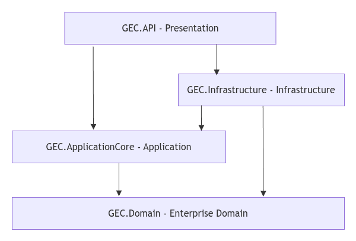

# Architecture & Project Structure Guide

This guide describes the **Clean Architecture / Onion Architecture** design of the **GEC** boilerplate. 

---

## 1. Directory Structure

The backend source code is organized into four projects representing layers, and a test project:

```
src/backend/
├── GEC.Domain/            # Enterprise/Domain Layer
├── GEC.ApplicationCore/   # Application Layer
├── GEC.Infrastructure/    # Infrastructure/Persistence Layer
├── GEC.API/               # Presentation Layer
└── GEC.Tests/             # Testing Suite
```

---

## 2. Layer Responsibilities



### A. Domain Layer (`GEC.Domain`)
*   **Purpose**: Contains enterprise rules, entity definitions, value objects, and core enums.
*   **Rules**: 
    *   **Zero external dependencies**: Must not reference any other project, database packages, or frameworks (no EF Core references).
    *   Must only contain pure C# code defining the data models (e.g. `TestUser.cs`) and base templates (`BaseEntity.cs`).
*   **Common Content**: `Entities/`, `Enums/`.

### B. Application Core Layer (`GEC.ApplicationCore`)
*   **Purpose**: Contains business logic, workflows, DTO structures, validations, mapping configurations, and abstract interfaces.
*   **Rules**:
    *   References `GEC.Domain`.
    *   Must not reference `GEC.Infrastructure`. It does not know *how* data is saved, only that it can be saved (via abstract repository interfaces).
*   **Common Content**:
    *   `Interfaces/`: Repository and service interfaces (e.g., `IUnitOfWork`, `IBaseRepository<T>`, `ITestUserService`).
    *   `Services/`: Use case orchestrations and business services (e.g., `TestUserService`).
    *   `DTOs/`: Data Transfer Objects for requests and responses (e.g., `PaginationParams`, `PagedResult<T>`).
    *   `Mappers/`: AutoMapper profiles to map between entities and DTOs (e.g., `TestUserProfile`).
    *   `Validators/`: FluentValidation validators for request models.
    *   `Exceptions/`: Custom business exceptions mapping to RFC 7807 `ProblemDetails` (e.g., `NotFoundException`).

### C. Infrastructure Layer (`GEC.Infrastructure`)
*   **Purpose**: Handles physical operations, database interactions, external APIs integrations, mail services, and file management.
*   **Rules**:
    *   References `GEC.ApplicationCore` and `GEC.Domain`.
    *   Implements the abstract interfaces declared in the Application Core (e.g., `UnitOfWork`, `BaseRepository`).
*   **Common Content**:
    *   `Persistence/`: `ApplicationDbContext`, entity configurations (Fluent API), and Migrations.
    *   `Repositories/`: Database read/write implementation details.
    *   `Extensions/`: Database-specific extension methods (e.g. EF-Core IQueryable paging, sorting, searching).
    *   `Services/`: Concrete system adapters (e.g. mailers, storage).

### D. Presentation / API Layer (`GEC.API`)
*   **Purpose**: The entry point of the application. Listens to HTTP requests, handles serialization, manages user authentication, and routes actions.
*   **Rules**:
    *   References `GEC.Infrastructure` and `GEC.ApplicationCore` to register dependencies into the IoC container.
    *   Should perform minimal to no business logic; it simply converts HTTP inputs to Application Core constructs and returns standard HTTP responses.
*   **Common Content**:
    *   `Controllers/`: Handles routes, requests binding, and output response mappings.
    *   `Handlers/`: Global exception handlers (`IExceptionHandler`) to map unhandled exceptions to RFC 7807 `ProblemDetails`.
    *   `Program.cs` & `DependencyInjection.cs`: Application bootstrapping, registering layers (`AddPresentation`, `AddApplicationCore`, `AddInfrastructure`), configuring Swagger, Serilog logging, and validation pipelines.

---

## 3. Request-Response Lifecycle Flow

1.  **Client Request**: The client sends a request (e.g., `POST /api/test` with payload).
2.  **API Layer**: 
    *   `TestController` receives the request.
    *   FluentValidation auto-validates the payload before invoking the action (returning `400 Bad Request` with a standard `ValidationProblemDetails` response if validation fails).
3.  **Application Layer**:
    *   Controller invokes the appropriate service (e.g. `TestUserService`).
    *   The service performs use-case logic, fetches data through repository interfaces (`IUnitOfWork.TestUser`), processes operations, and maps results to response DTOs using `IMapper`.
    *   If business rules are violated, it throws a subclass of `AppException` (e.g., `NotFoundException`).
4.  **Infrastructure Layer**:
    *   Repositories interact with `ApplicationDbContext` (PostgreSQL) using EF Core and database query extensions to filter/page/sort.
5.  **Error Handling (Global Exception Handler)**:
    *   If any service throws an exception, the ASP.NET Core exception handling middleware invokes `GlobalExceptionHandler` to catch it, map it to the corresponding HTTP status code (e.g., 404 for `NotFoundException`), and serialize it as a standard `ProblemDetails` JSON response.
6.  **HTTP Response**: The API returns the response DTO or standard Problem Details JSON back to the client.
